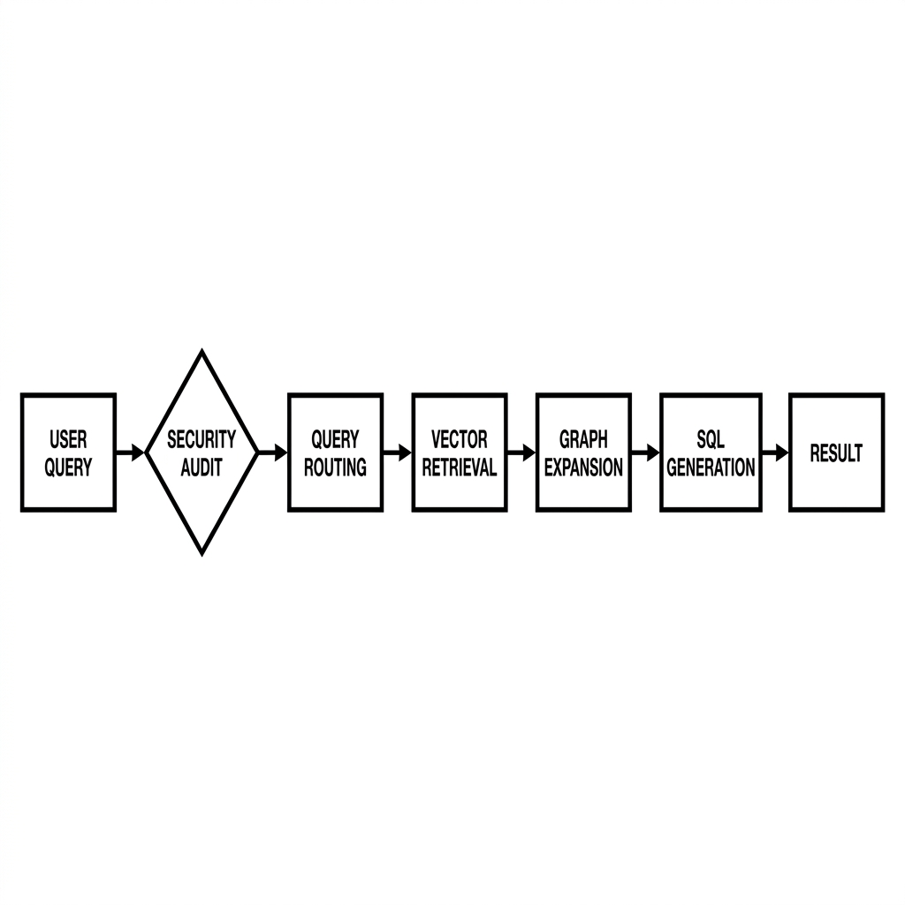

# Sovereign SQL Engine

[](https://fastapi.tiangolo.com)
[](https://reactjs.org)
[](https://www.docker.com/)

An industry-grade, enterprise-ready Text-to-SQL platform designed for high-concurrency, real-time data exploration. It provides a secure, streaming interface to transform natural language into optimized SQL queries, augmented by Graph and Vector retrieval.

---

## 🚀 Key Features

- **Real-Time SSE Streaming**: Get instant sub-millisecond feedback on every stage—from safety checks to final data retrieval.
- **Hybrid RAG Logic**: Combines **Pinecone** (Vector Search) for semantic matching with **Neo4j** (Graph Expansion) to discover optimal JOIN paths.
- **Advanced Model Routing**: Automatically handles "difficult" queries using Qwen3 for logic enhancement.
- **Self-Correcting Execution**: Detects SQL runtime errors and uses LLMs to fix and re-execute queries in real-time.
- **Cost-Optimized Inference**: Uses Modal serverless GPU snapshots for **<2s cold starts** and zero-cost idle time.
- **Durable Observability**: Full integration with Grafana Cloud (Loki & Prometheus) for tracking request latency, GPU health, and auditing.

---

## 🏗️ System Architecture



The engine follows a multi-tier query architecture designed to minimize latency while maintaining absolute accuracy:

1.  **Safety & Routing**: Llama Guard 3 security audit + Phi-4 complexity classification.
2.  **Schema Retrieval**: Semantic search (Pinecone) expanded by Graph relationships (Neo4j).
3.  **Generation & Fixing**: SQL drafting (Arctic/Phi-4) followed by optional refinement/correction (Qwen3).

> [!NOTE]
> For a technical deep dive, see **[Architecture Documentation](docs/ARCHITECTURE.md)**.

---

## 🛠️ Tech Stack

### AI & Inference
- **Models**: NVIDIA Arctic, Phi-4-mini, Llama Guard 3, Qwen3.
- **Platforms**: [Modal](https://modal.com) (Serverless GPUs), [RunPod](https://runpod.io).
- **Engine**: vLLM (Quantized AWQ4).

### Data & Retrieval
- **Vector DB**: Pinecone.
- **Graph DB**: Neo4j.
- **Metadata**: SQLite Cloud.
- **Execution DB**: Local SQLite.

### Infrastructure
- **Backend**: FastAPI (Python 3.12).
- **Frontend**: React 18, Vite, Vanilla CSS.
- **Monitoring**: Prometheus, Loki, Grafana, Promtail.

---

## 📂 Project Structure

```bash
sovereign-sql-engine/
├── backend/            # FastAPI Orchestrator (SSE, RAG, Metrics)
├── frontend/           # React Web Interface (Streaming UI)
├── modal_deployment/   # Serverless GPU Node scripts (L4/T4)
├── docs/               # Detailed Project Documentation (MD)
├── pipeline_test/      # End-to-end integration test suites
└── docker-compose.yml  # Local stack orchestration
```

---

## ⚡ Quick Start

### 1. Configure Environment
Copy `.env.example` to `.env` in the root and fill in your keys:
- `QWEN3_API_TOKEN`, `RUNPOD_API_KEY`, `PINECONE_API_KEY`, `SQLITE_CLOUD_CONN_STR`.

### 2. Launch with Docker
```bash
docker compose up --build -d
```
The application will be available at:
- **Frontend**: `http://localhost:3000`
- **Backend API**: `http://localhost:8000`
- **Metrics**: `http://localhost:8000/metrics/prometheus`

---

## 📖 Detailed Documentation

Explore our comprehensive guides for in-depth technical knowledge:

- 📐 **[System Architecture](docs/ARCHITECTURE.md)** - Multi-tier logic and data flow.
- ⚙️ **[Inference Infrastructure](docs/INFRASTRUCTURE.md)** - Modal, GPU Specs, and Cost Scaling.
- 🧬 **[RAG Pipeline & Graph Logic](docs/PIPELINE.md)** - Pinecone and Neo4j BFS expansion.
- 📊 **[Observability & Metrics](docs/OBSERVABILITY.md)** - Dashboard setup and Prometheus logs.
- 📡 **[SSE Event Specification](docs/SSE_EVENTS.md)** - Streaming protocol details.
- 🏎️ **[Performance Benchmarks](docs/PERFORMANCE.md)** - Load testing and async metrics.

---

## 👨‍💻 Contributing

1. Fork the repo and create your branch.
2. Ensure all changes are reflected in both the `backend/` logic and the corresponding `docs/` file.
3. Submit a PR for review.

---

**Sovereign SQL Engine** — *Privacy-First, Context-Aware, Enterprise Text-to-SQL.*
