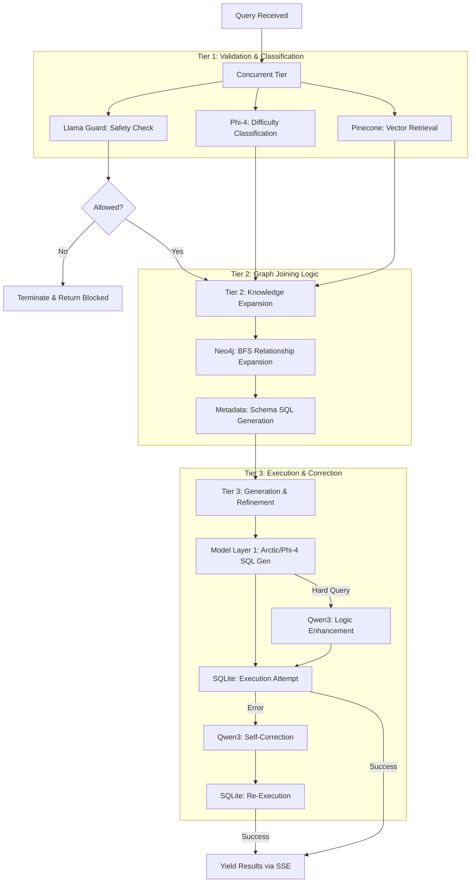

# System Architecture

The Sovereign SQL Engine is designed as a distributed, multi-tier system that prioritizes throughput, safety, and observability.

## Component Overview

The system consists of three primary layers:

### 1. Presentation & Interface (Frontend)
- **Tech Stack**: React 18, Vite, Vanilla CSS.
- **Role**: Provides a real-time, event-driven UI.
- **Communication**: Establishes a persistent SSE (Server-Sent Events) connection to the backend for streaming responses.

### 2. Logic & Orchestration (Backend)
- **Tech Stack**: FastAPI (Python 3.12).
- **Role**: The brain of the system. It handles:
    - **SSE Execution**: Orchestrating parallel pipeline tasks using `asyncio`.
    - **Multi-DB Interaction**: Managing connections to SQLite Cloud, Pinecone, and Neo4j.
    - **Observability**: Exporting metrics to Prometheus and logs to Loki.
    - **Caching**: Managing a thread-safe LRU cache for high-frequency queries.

### 3. Inference & Storage (Data Layer)
- **Inference (Modal/RunPod)**: Serverless compute nodes running optimized vLLM engines.
- **Metadata (SQLite Cloud)**: Distributed SQLite hosting for global metadata and persistence.
- **Knowledge Retrieval**:
    - **Vector (Pinecone)**: Semantic search for column and table candidates.
    - **Graph (Neo4j)**: Schema relationship expansion for JOIN path accuracy.

## Multi-Tier Query Architecture

The pipeline follows a tiered execution strategy to minimize latency while maximizing accuracy:

## Internal Communication Flow

1.  **Async Orchestration**: The backend uses its `SSEPipelineExecutor` to launch Tiers 1 and 2 in parallel blocks where possible.
2.  **Streaming Feedback**: Every sub-stage (Pinecone result, Neo4j expansion, etc.) is pushed into an `asyncio.Queue` and immediately sent to the user as an SSE event.
3.  **Trace Propagation**: A unique `request_id` and `trace_id` are passed through all tiers, allowing Grafana to correlate backend logs with Modal inference traces.
