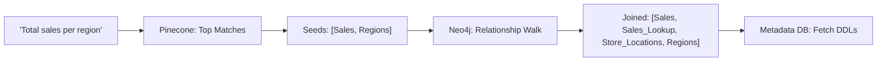

# Text-to-SQL Pipeline Logic

The Sovereign SQL Engine employs a sophisticated RAG (Retrieval-Augmented Generation) pipeline that combines structural knowledge, semantic similarity, and graph-based relationship expansion.

## Stage 1: Validation & Classification

Every query starts with a dual safety and complexity check:
1.  **Safety (Lama Guard 3)**: Audits the user input against a custom safety taxonomy. If unsafe, the pipeline terminates immediately.
2.  **Classification (Phi-4)**: Determines if the query is `easy`, `difficult`, or `out_of_topic`. 
    - `Difficult` queries are flagged for a secondary "Refinement" layer during generation.
    - `Out of topic` queries exit early with a helpful remark.

## Stage 2: Recursive Retrieval (Vector + Graph)

To provide the LLM with the most relevant schema context, we use a hybrid retrieval strategy:

### 1. Vector Retrieval (Pinecone)
- Performed on both **Tables** and **Columns**.
- Uses semantic embeddings to find the most likely candidates based on the user's natural language terminology.
- Supports "Database Filtering" to ensure results stay within the same technical domain.

### 2. Graph Relationship Joining (Neo4j)

Semantic search often misses "bridge" tables which are necessary for complex JOINs. We solve this using **Neo4j**:

- **Seed**: The top results from Pinecone are used as "seed" nodes.
- **BFS Expansion**: The engine performs a multi-hop (default max_hops=4) Breadth-First Search from the seed nodes.
- **Goal**: Identify all intermediate tables that link the semantically relevant tables together.
- **Result**: A complete, joinable schema subset is retrieved and passed to the next stage.

## Stage 3: Generation & Self-Correction

### 1. Model Layering
- **Primary Model**: Arctic or Phi-4-mini generates the initial SQL draft.
- **Advanced Refinement**: If the query was classified as `difficult`, the draft is sent to **Qwen3** alongside the schema and original question. Qwen3 reviews the logic, optimizes joins, and returns a refined "Production Grade" query.

### 2. Execution & Firewall
- Before execution, the SQL is run through a **Firewall Parser**. 
- It ensures only `SELECT` operations are allowed and injects a `LIMIT 100` if the user hasn't specified one, protecting the database from resource-heavy accidental queries.

### 3. Self-Correction Loop
If the database driver returns an error (e.g., `no such column` or `JOIN ambiguous`):
1.  The error message and the faulty SQL are packed together.
2.  **Qwen3 (Advanced Model)** is consulted to fix the error.
3.  The corrected SQL is re-executed and returned to the user via SSE.
